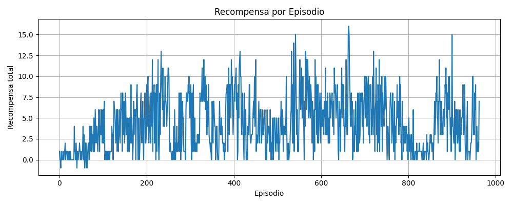

# 🧾 Reporte de Avance - Proyecto ViZDoom RL Visual

## 📅 Fecha
Julio 2025

## 🎯 Resumen General

Este documento presenta el avance del proyecto de entrenamiento de un agente de refuerzo profundo (DRL) en el escenario **Defend the Center** del entorno ViZDoom. El agente es entrenado exclusivamente mediante imágenes procesadas del entorno, sin acceso a variables internas del motor de juego.

---

## 🤖 Modelo Usado: `DQNWithAttention`

Se ha implementado y entrenado un modelo **DQN con Mecanismo de Atención Espacial**, basado en el archivo `dqn_att.py`. Esta arquitectura extiende al modelo clásico DQN al incluir una capa de atención que permite al agente concentrarse en regiones específicas de la imagen de entrada.

### Características de la arquitectura:

- **Entrada**: Tensores de forma `[4, 100, 160]` (stack de 4 imágenes en escala de grises).
- **Bloques Convolucionales**: Tres capas Conv2D con `ReLU`, seguidas de normalización opcional.
- **Módulo de Atención**:
  - Calcula un mapa de atención sobre las características espaciales.
  - Aplica pesos adaptativos sobre regiones de la imagen.
- **Capa Fully Connected**: Después de la atención, se reduce a un vector de salida de Q-valores para cada acción.

Esta atención permite al modelo priorizar áreas de interés visual (como enemigos o municiones), mejorando la capacidad de generalización y velocidad de aprendizaje en entornos visuales complejos.

---

## 📈 Resultados del Entrenamiento

Se ha completado un entrenamiento de **1000 episodios**. El progreso se almacenó en los checkpoints y se generó una curva de rendimiento.

### 🖼️ Gráfica de Recompensa por episodio

---

## 👁️ Procesamiento Visual

El procesamiento visual es fundamental para el aprendizaje del agente, ya que las decisiones se basan exclusivamente en lo que "ve". Para ello se ha creado una clase central: `GrayscaleProcessor`.

### Funcionalidades implementadas:

- **Conversión a escala de grises**: reduce la dimensionalidad y resalta formas.
- **Redimensionamiento uniforme**: se reescalan las imágenes a `[100 x 160]`, normalizando el input para la red.
- **Normalización**: valores de píxel llevados a rango `[0, 1]`.
- **Detección de bordes**: realce de contornos y siluetas mediante kernels.

### Posibilidades adicionales ya contempladas:

- Aplicación de filtros como:
  - Sharpening (agudizado)
  - Gaussian Blur
  - Thresholding adaptativo

Esto permite una alta flexibilidad en la experimentación con distintas representaciones visuales para evaluar su impacto en el rendimiento del agente.

---

## 🧪 Experimentos en Curso

- Pruebas comparativas con modelo `DQN` base (sin atención).
- Evaluación del impacto de los filtros visuales en el aprendizaje.

---

## 📌 Conclusiones Parciales

- El uso de atención espacial ha mostrado una mejora temprana en la convergencia del agente.
- El procesamiento visual robusto ha permitido entrenar sin acceso a variables internas del juego.
- El agente aprende únicamente a través de imágenes, acercándose a un control visual autónomo.

---

