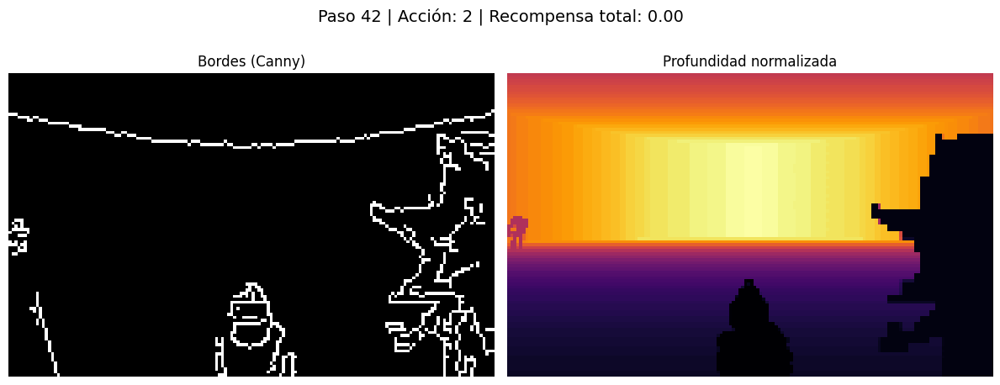

# Informe Técnico: Agente RL en ViZDoom - Defend the Center

## 1. Introducción

Este informe describe el proceso de entrenamiento de agentes de aprendizaje por refuerzo profundo (Deep RL) para resolver el escenario **Defend the Center** del entorno ViZDoom. El objetivo es comparar distintas representaciones de observación y su impacto en el desempeño del agente, utilizando técnicas de procesamiento de imágenes y variables adicionales del entorno.

---

## 2. Entorno y Configuración

Se utiliza el entorno *Defend the Center*, personalizado para proporcionar al agente la observación visual y, en algunos casos, información adicional como la salud y la munición restantes.

**Versiones y librerías clave:**
- Python 3.9
- ViZDoom
- PyTorch
- OpenCV

---

## 3. Preprocesamiento de Observaciones

Se evaluaron tres configuraciones principales para la observación del agente:

### 3.1. Canny + Escala de Grises

Procesamiento:
```python
gray = cv2.cvtColor(np.moveaxis(observation, 0, -1), cv2.COLOR_BGR2GRAY)
resized = cv2.resize(gray, (160, 100), interpolation=cv2.INTER_CUBIC)
edges = cv2.Canny(resized, 100, 200)
return np.reshape(edges, (100, 160, 1))

---

### 3.2. Canny + Escala de Grises + Profundidad

Procesamiento:
```python
rgb = state.screen_buffer
rgb = np.moveaxis(rgb, 0, -1)
gray = cv2.cvtColor(rgb, cv2.COLOR_BGR2GRAY)
edges = cv2.Canny(cv2.resize(gray, (160, 100)), 100, 250)
depth = state.depth_buffer
depth_norm = cv2.resize(depth, (160, 100))
depth_norm = ((depth_norm - np.min(depth_norm)) / (np.ptp(depth_norm) + 1e-5) * 255).astype(np.uint8)
return np.stack([edges, depth_norm], axis=-1)
```
**Resultado ejemplo:**  


---

### 3.3. Canny + Profundidad + Variables Internas

En este modo se utiliza la misma entrada que el anterior pero además se integran variables del juego como la salud y la munición, las cuales son concatenadas a la entrada de la red neuronal.

---

## 4. Arquitecturas de Red Neuronal

El proyecto utiliza tres arquitecturas principales:

### 4.1. Red Convencional (CNN básica)
Usada en los casos de entrada simple (solo imagen o imagen+profundidad):
- Varias capas `Conv2d` seguidas de activaciones `ReLU`.
- Capa `Flatten` para conectar a una o varias `Linear` (fully connected).
- Salida final igual al número de acciones.

### 4.2. CNN con Canal de Profundidad
Igual a la anterior, pero la entrada es de dos canales: bordes + mapa de profundidad.
- Primer `Conv2d` recibe shape `[batch, 2, 100, 160]`.
- El resto de la arquitectura es igual, con mayor capacidad para extraer características combinadas de ambos mapas.

### 4.3. CNN + Variables de Juego + Recurrente (GRU/LSTM)
Usada para entradas con variables internas:
- Módulo de convolución para imágenes.
- Concatenación con vector de variables (`[salud, munición]`).
- Pasaje por capas lineales y finalmente una capa recurrente (ejemplo: GRU).
- Permite mantener memoria temporal, mejorando el rendimiento en tareas secuenciales.


---

## 5. Resultados de Entrenamiento y Análisis de Desempeño

En los tres casos evaluados, el agente logró alcanzar una recompensa máxima de **16 puntos**, lo que indica que el modelo aprendió exitosamente la tarea de defender el centro.

A continuación se muestran las curvas de recompensa obtenidas durante el entrenamiento (archivos `reward_curve.png` de cada subcarpeta de `checkpoints/`):

### Caso 1: Imagen (Canny+Grises)


### Caso 2: Imagen + Profundidad


### Caso 3: Imagen + Profundidad + Variables internas


Estas gráficas muestran cómo al inicio, el modelo explora y toma muchas decisiones aleatorias (por el uso de la estrategia epsilon-greedy), lo que genera gran variabilidad en la recompensa. A medida que avanza el entrenamiento y se explota más la política aprendida, la recompensa aumenta y se estabiliza cerca del máximo posible.

---

## 6. Conclusiones

- El agente logró aprender a defender el centro de forma óptima en los tres tipos de observación, alcanzando siempre la recompensa máxima.
- La inclusión del canal de profundidad y las variables internas mejoró la rapidez del aprendizaje y la estabilidad de la política.
- El preprocesamiento con técnicas clásicas de visión por computador (Canny, normalización, resize) es suficiente para potenciar el aprendizaje profundo en este entorno.

---

**Repositorio:** https://github.com/smindiol/vizdoom_rl_project
